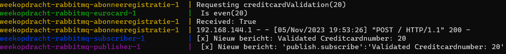

# RabbitMQ Weekopdracht 4

Voor deze opdracht is er een applicatie gemaakt die bestaat uit verschillende microservices. De microservices communiceren met elkaar doormiddel van RabbitMQ om de applicatie op deze manier volledig fucntioneel te maken. De architectuur van de applicatie is terug te vinden in opdracht.md. 

De microservices zijn gemaakt in verschillende programmeertalen. De verdeling ervan ziet er als volg uit:

- Javascript -> Abonneeservice
- Python -> Eurocardservice & AbonneeRegistratieservice
- Java -> Publisherservice

## Werking

Om de applicatie uit te voeren moet er het volgende gebeuren:

* Navigeer naar de hoofdfolder van de applicatie
* Voer het command ```docker compose up --build``` uit. Dit start de applicatie op. abonneeRegistratie is te bereiken via een POST request op poort 8080.
* Stuur een bericht naar abonneeRegistratie door de volgende command uit te voeren. ```curl -X POST -d <creditcardnummer> http://localhost:8080```. Hierbij kan creditcardnummer een even of een onevengetal zijn. Om deze command uit te voeren moet een nieuwe window geopend worden.  
## Logging

Om te kijken of alles daadwerkelijk werkt hebben wij gebruik gemaakt van logs. De logs die hieronder in het voorbeeld te zien zijn betekenen hetvolgende:

* ```Requesting creditcardValidation(<creditcardnummer>)``` request met ```<creditcardnummer>``` is binnengekomen en wordt verstuurd naar de microservice Eurocard.

* ```Is even <creditcardnummer>``` geeft aan dat ```<Creditcardnummer>``` is aangekomen bij Eurocard

* ```Received: <Boolean>``` Abonneeregistratie heeft bericht teruggekregen van Eurocard waarbij  ```<Boolean>``` hetgeen is wat terug is gestuurd. Het is ```True```  wanneer creditcardnummer even is en ```False``` wanneer het oneven is

* ```[x] Nieuw bericht: Validated Creditcardnumber: <creditcardnummer>``` geeft aan dat ```< <creditcardnummer>``` is aangekomen bij subscriber.

* ```[x] Nieuw bericht: 'publish.subscribe':'Validated Creditcardnumber: <creditcardnummer>'``` geeft aan dat  ```<creditcardnummer>``` is aangekomen bij publisher.




### Routing/keys

routing/keys die gebruikt zijn voor de applicatie

#### CreditcardValidatieClient & eurocard

- Exchange: ''
- Routing_Key: 'register'

### NotificatieClient & Publisher/Subscriber

- Exchange: 'topic_logs'
- routing_key: 'publish.subscribe'

'publish.*' voor Publisher

'*.subscribe' voor Subscribe
